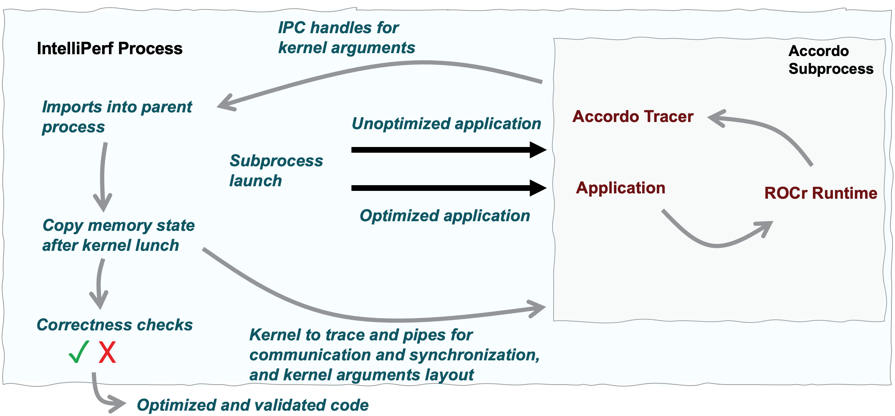

<!--
MIT License

Copyright (c) 2025 Advanced Micro Devices, Inc. All Rights Reserved.

Permission is hereby granted, free of charge, to any person obtaining a copy
of this software and associated documentation files (the "Software"), to deal
in the Software without restriction, including without limitation the rights
to use, copy, modify, merge, publish, distribute, sublicense, and/or sell
copies of the Software, and to permit persons to whom the Software is
furnished to do so, subject to the following conditions:

The above copyright notice and this permission notice shall be included in all
copies or substantial portions of the Software.

THE SOFTWARE IS PROVIDED "AS IS", WITHOUT WARRANTY OF ANY KIND, EXPRESS OR
IMPLIED, INCLUDING BUT NOT LIMITED TO THE WARRANTIES OF MERCHANTABILITY,
FITNESS FOR A PARTICULAR PURPOSE AND NONINFRINGEMENT. IN NO EVENT SHALL THE
AUTHORS OR COPYRIGHT HOLDERS BE LIABLE FOR ANY CLAIM, DAMAGES OR OTHER
LIABILITY, WHETHER IN AN ACTION OF CONTRACT, TORT OR OTHERWISE, ARISING FROM,
OUT OF OR IN CONNECTION WITH THE SOFTWARE OR THE USE OR OTHER DEALINGS IN THE
SOFTWARE.
-->

# IntelliPerf: An Automated Framework for GPU Performance Engineering

*The manual optimization of GPU kernels is a complex, time-consuming, and error-prone process that requires deep domain expertise, which is a scarce resource. This article introduces IntelliPerf, an automated performance engineering framework developed by AMD Research and Advanced Development (RAD) that systematizes and automates this workflow. IntelliPerf orchestrates a suite of profiling, instrumentation, and analysis tools (Figure 1) to automatically pinpoint performance bottlenecks, generate optimized code using Large Language Models (LLMs), and validate the results for both correctness and speed. By integrating seamlessly into a CI/CD pipeline, IntelliPerf enables continuous, automated performance improvement, effectively acting as an AI performance engineer. This work demonstrates a novel approach to combining program analysis with generative AI to address the challenges of GPU software optimization.*

<p align="center">
  <br>
  <i>Figure 1: The IntelliPerf toolchain, orchestrating a suite of existing and novel AMD tools for automated performance engineering.</i>
</p>

The performance of High-Performance Computing (HPC) applications is increasingly dominated by the efficiency of their GPU kernels. However, optimizing these kernels is a significant challenge. The process requires a deep understanding of the underlying hardware architecture, a mastery of various low-level profiling tools, and the ability to manually rewrite code to resolve subtle bottlenecks such as memory access inefficiencies or contention issues. This expertise is rare, and the manual tuning cycle is a major bottleneck in software development, consuming significant engineering resources and delaying time-to-solution.

Existing tools often address only isolated parts of this problem—a profiler may reveal a bottleneck but offers no path to resolution, while a static analyzer may flag potential issues without contextual performance data. This leaves a critical gap: the "last mile" of interpreting the data, forming a hypothesis, rewriting the code, and validating the change remains a purely manual effort.

This article presents IntelliPerf, the _maestro_ that automates this entire end-to-end workflow. Inspired by the process of expert human engineers, it profiles the code, diagnoses the bottleneck, rewrites the kernel, and validates the fix. By orchestrating a toolchain of advanced program analysis and generative AI technologies, IntelliPerf significantly reduces the time and expertise required to optimize GPU code.

## How It Works: The IntelliPerf Workflow

IntelliPerf is designed as a modular, extensible system that can be configured to target specific, well-known performance bottlenecks.

### The Formula-Driven Architecture

At its core, IntelliPerf is built on a "formula-driven" architecture. Each common GPU performance issue is abstracted into a **Formula**. Users can select a specific bottleneck to target, such as `bankConflict`, `atomicContention`, or `memoryAccess`, through a configuration option.

This modular design is implemented through an object-oriented approach where a **base formula** defines a universal, multi-stage optimization workflow. **Specialized formulas** then inherit from this base and implement the specific logic for a particular bottleneck, such as the exact performance counters to query and the precise prompts to send to the AI.

### The Multi-Stage Optimization Loop

IntelliPerf executes a closed-loop process that systematically moves from high-level profiling to a validated code change, as illustrated in Figure 2.

<p align="center">
  <br>
  <i>Figure 2: The multi-stage optimization loop executed by IntelliPerf.</i>
</p>

1.  **Profiling (`rocprofv3`)**: The process begins with a timing run to identify the most time-consuming kernel in the application. A second, more detailed run then collects a rich set of hardware performance counters relevant to the chosen formula.

2.  **Analysis (`Guided Tuning` & `Omniprobe`)**: The performance counters are first analyzed by **`Guided Tuning`**, a tool that summarizes the data to identify the likely issue. **`Omniprobe`** then uses compiler-based instrumentation to pinpoint the specific source code line responsible for the bottleneck.

3.  **Code Generation (`Omniwiser`)**: Armed with this data, **`Omniwiser`**, a novel component built for IntelliPerf, crafts a detailed, context-aware prompt for an LLM to generate an optimized version of the code.

4.  **Validation (`Accordo`)**: The LLM-generated code is then validated for both correctness and performance by **`Accordo`**, another novel tool developed for the IntelliPerf project.

## Key Technologies

IntelliPerf's success relies on the tight integration of several key technologies.

### Iterative AI-Powered Optimization

The interaction with the LLM is not a simple one-shot request. IntelliPerf employs a sophisticated, iterative feedback loop managed by a wrapper around the **DSPy** library. If an LLM-generated optimization is incorrect or not performant, IntelliPerf analyzes the failure and re-prompts the LLM with corrective feedback (e.g., "The previous attempt failed a correctness check..."). This cycle continues until a validated solution is found.

### Accordo: Automated Runtime Validation

Correctness validation is handled by Accordo, a tool that operates as an HSA Tools Library. This allows it to intercept ROCm runtime calls and inspect GPU memory to compare the output of the optimized kernel against the original, all without any application code changes (Figure 3). To robustly handle floating-point arithmetic, Accordo supports a user-defined absolute tolerance for comparisons.

<p align="center">
  <br>
  <i>Figure 3: The Accordo validation workflow, which intercepts runtime calls to compare memory outputs.</i>
</p>

## Automated CI/CD Workflow

IntelliPerf is designed to be served as a GitHub Action, enabling continuous, automated performance analysis in a CI/CD environment (Figure 4). When a successful optimization is found, IntelliPerf can automatically generate a pull request with the validated fix, including a summary of the bottleneck, and the measured performance improvement. The final pull request is the culmination of the entire automated workflow, presenting the developer with a ready-to-merge solution (Figure 5).

<p align="center">
  <br>
  <i>Figure 4: A GitHub Actions workflow snippet demonstrating how to integrate IntelliPerf using the maestro-action.</i>
</p>


<p align="center">
  <br>
  <i>Figure 5: An example of an automatically generated pull request containing a validated optimization.</i>
</p>

### Illustrative Example: Resolving Atomic Contention

The following patch demonstrates IntelliPerf's output. The framework identified an inefficient atomic operation inside a kernel and replaced it with a highly efficient parallel reduction using shared memory, a non-trivial optimization that typically requires significant expertise to implement correctly.

```diff
--- a/examples/contention/reduction/reduction.hip
+++ b/examples/c/contention/reduction/reduction.hip
@@ -28,10 +28,26 @@
 __global__ void reduction_kernel(const float* input, float* result, std::size_t count) {
-  const auto thread_id = threadIdx.x + blockIdx.x * blockDim.x;
-  if (thread_id < count) {
-    const auto value = input[thread_id];
-    atomicAdd(result, value / (thread_id + 1));
+  extern __shared__ float sdata[];
+  const unsigned int tid = threadIdx.x;
+  const unsigned int idx = blockIdx.x * blockDim.x + tid;
+  // load input into shared memory
+  float val = 0.0f;
+  if (idx < count) {
+    val = input[idx] / (idx + 1);
   }
+  sdata[tid] = val;
+  __syncthreads();
+  // do reduction in shared memory
+  for (unsigned int s = blockDim.x / 2; s > 0; s >>= 1) {
+    if (tid < s) {
+      sdata[tid] += sdata[tid + s];
+    }
+    __syncthreads();
+  }
+  // write result for this block to global memory
+  if (tid == 0) {
+    atomicAdd(result, sdata[0]);
+  }
 }
```

## Future Work and Roadmap

IntelliPerf's formula-driven architecture is extensible. Future work will focus on expanding its capabilities by adding new formulas to address other critical performance bottlenecks, including:
*   Register Pressure
*   Branch Divergence
*   Memory Locality

We also plan to extend support to other programming models, such as Triton, and to conduct a rigorous quantitative evaluation of IntelliPerf's effectiveness across a wide range of HPC benchmarks and applications.

## Conclusion

IntelliPerf presents a significant step towards the automation of GPU performance engineering. By combining classical program analysis with the generative power of LLMs in a robust, closed-loop framework, it provides a scalable solution to a critical software development challenge. This approach not only accelerates the optimization cycle but also democratizes performance engineering, allowing non-expert developers to achieve expert-level results and freeing up domain experts to focus on more complex, architectural challenges.
